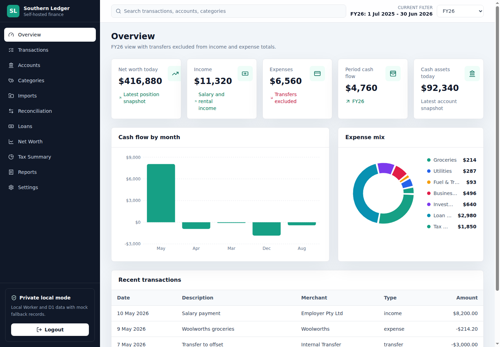
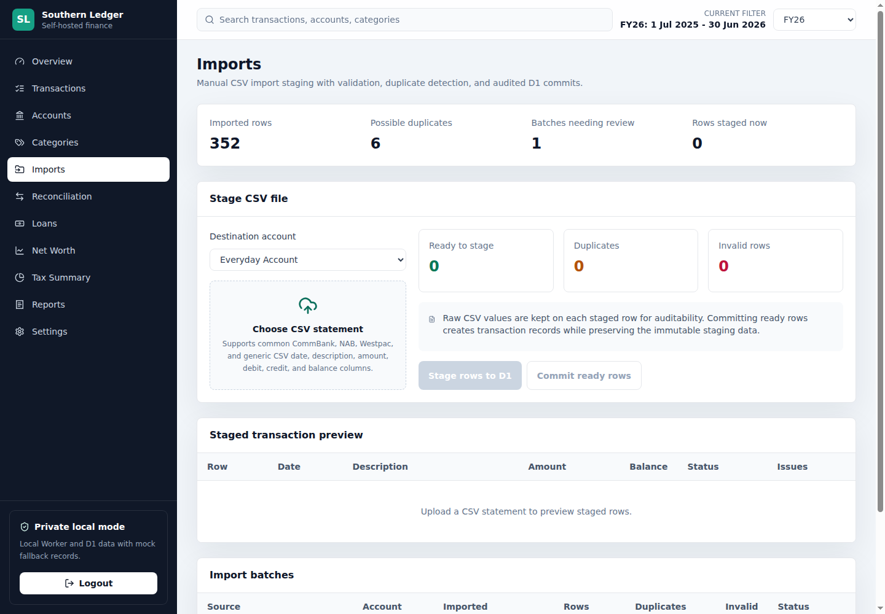
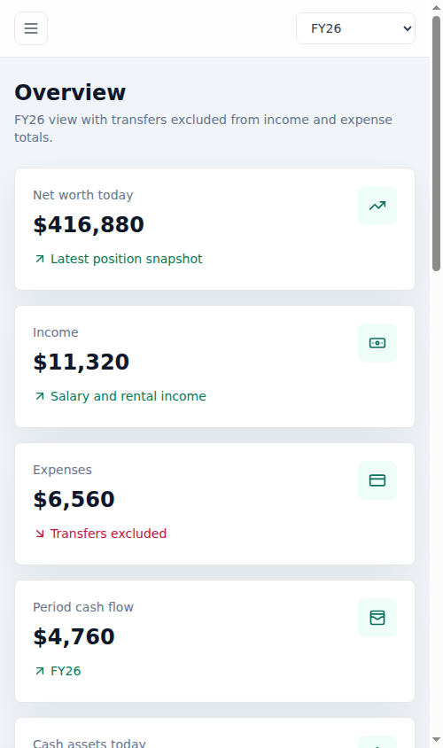

# Southern Ledger

Southern Ledger is a self-hostable personal finance dashboard for Australian households, sole traders, and property investors.

It focuses on practical day-to-day finance work: account balances, cash flow, Australian financial year filtering, CSV imports, transaction review, reconciliation, tax tags, loan tracking, assets, liabilities, and net worth reporting.



## Why This Exists

Most finance tools are either cloud-first, bank-feed-first, or too generic for Australian tax-time review. Southern Ledger is built for people who want to keep their financial records private, import statements manually when needed, and still get a useful dashboard for cash flow, tax categories, loans, and net worth.

The project starts with Cloudflare Workers and D1 because that stack is inexpensive, private by default when paired with Access, and easy to deploy. The frontend can still be used locally with mock data before any backend is configured.

## Features

- Responsive React dashboard with account, transaction, tax, loan, and net worth views
- Australian financial year support from 1 July to 30 June
- Manual CSV import workflow with staging, validation, duplicate checks, and commit steps
- Category rules, tax tags, transfer matching, and loan split suggestions
- Mock fallback data for local UI development
- Cloudflare Workers and D1 backend for private self-hosted deployments

## Screenshots

| Overview | CSV imports |
| --- | --- |
|  |  |

| Mobile overview |
| --- |
|  |

## Stack

- React, TypeScript, Vite, Tailwind CSS
- Recharts for data visualisation
- Cloudflare Workers API
- Cloudflare D1 database
- Zod validation
- PapaParse CSV parsing
- date-fns date utilities

## Getting Started

```bash
npm install
cp .env.example .env.local
npm run dev
```

In a second terminal, run the local Worker API:

```bash
npm run dev:api
```

The frontend falls back to mock data when the local API is unavailable, so the interface can be explored before D1 is configured.

## Project Status

Southern Ledger is an early public baseline. It is useful for exploring the dashboard, local development, CSV import workflows, and Cloudflare deployment patterns, but it is not a finished accounting product.

Current focus:

- Better CSV import adapters
- More reconciliation review workflows
- Clearer Cloudflare deployment docs
- Export and accountant summary improvements
- Optional provider-agnostic backend notes

## Local Database

Apply D1 migrations locally:

```bash
npm run db:migrate:local
```

Seed data in `migrations/` is synthetic and intended for development only.

## Deployment

Cloudflare Workers and D1 are supported out of the box. The checked-in `wrangler.jsonc` uses a placeholder D1 database ID so it is safe to share.

For deployment, create your own D1 database, set your values in `.env.local`, then generate the ignored deployment config:

```bash
npm run deploy:prepare
npm run deploy:check
```

See `DEPLOYMENT.md` and `SECURITY.md` before using real financial data.

## Contributing

Contributions are welcome, especially around statement formats, reconciliation workflows, documentation, and deployment examples.

Start with `CONTRIBUTING.md` before opening a pull request.

## Security

This app handles sensitive financial information. Keep real bank exports, production database IDs, API tokens, `.dev.vars`, and generated deployment configs out of version control.

For internet-accessible deployments, put the dashboard behind an authentication layer such as Cloudflare Access, a reverse proxy with SSO, or your hosting provider's private access controls.

## License

MIT
